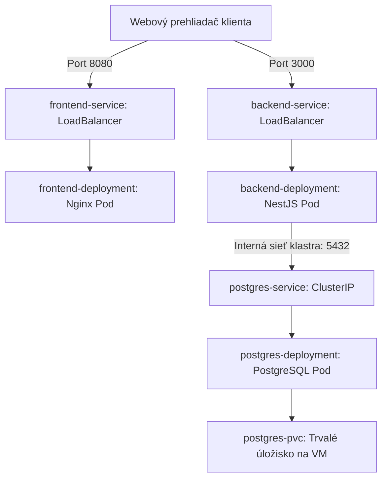

# Príručka pre Nasadenie Fullstack Aplikácie do K3s (Kubernetes) 🚀

Tento dokument slúži ako kompletný návod na nastavenie čistého virtuálneho servera (VM), inštaláciu K3s a následné nasadenie a správu našej kontajnerizovanej fullstack aplikácie. Príručka je pripravená v profesionálnom formáte vhodnom pre firemné prostredie.

---

## 📋 1. Predpoklady a Príprava VM

Nasadenie predpokladá čistú inštanciu virtuálneho servera s operačným systémom **Ubuntu Server (20.04 LTS alebo 22.04 LTS)**.

### Sieťové nastavenia (Firewall / Security Groups)
Na VM je potrebné povoliť prichádzajúcu prevádzku (ingress) na nasledovných portoch:
*   `22/TCP` (SSH prístup)
*   `8080/TCP` (Frontend aplikácia)
*   `3000/TCP` (Backend API)
*   `6443/TCP` (Iba ak potrebujete pristupovať ku Kubernetes API zvonku)

---

## ⚙️ 2. Inicializácia K3s na VM

K3s je odľahčená distribúcia Kubernetes, ideálna pre menšie VM a single-node klastre.

### Inštalácia
Pripojte sa na VM cez SSH a spustiť:
```bash
# Aktualizácia balíčkov operačného systému
sudo apt update && sudo apt upgrade -y

# Inštalácia K3s (automaticky nainštaluje control plane, worker node a nástroj kubectl)
curl -sfL https://get.k3s.io | sh -
```

### Overenie stavu klastra
Po dokončení inštalácie overte, či je uzol (node) pripravený:
```bash
sudo kubectl get nodes
```
*Očakávaný výstup: Názov vášho uzla v stave `Ready`.*

---

## 🛠️ 3. Šikovný Kubernetes Cheatsheet (Užitočné príkazy)

Pre správu a údržbu aplikácie v K3s budete najčastejšie využívať nasledovné príkazy.

### Monitorovanie stavu
*   `kubectl get pods` - Zobrazí zoznam všetkých spustených kontajnerov (Podov) a ich stav (`Running`, `Error`, `CrashLoopBackOff`).
*   `kubectl get services` - Zobrazí zoznam služieb, ich interné IP adresy a mapované verejné porty (`LoadBalancer` / `ClusterIP`).
*   `kubectl get pvc` - Skontroluje stav diskov (Persistent Volume Claims) na ukladanie dát.

### Riešenie problémov a Logy (Troubleshooting)
*   `kubectl logs -f <pod-name>` - Sleduje živé logy (výstupy) z vybraného kontajnera (veľmi dôležité pri hľadaní chýb v aplikácii).
*   `kubectl describe pod <pod-name>` - Vypíše detailné systémové informácie o pode (napr. dôvod, prečo kontajner zlyhal pri štarte alebo nedostatok pamäte).
*   `kubectl exec -it <pod-name> -- sh` - Otvorí interaktívny terminál priamo vnútri bežiaceho kontajnera (vhodné pre manuálne overenie databázy a pod.).

### Správa zdrojov
*   `kubectl apply -f <priečinok-alebo-súbor>` - Aplikuje (nasadí alebo zaktualizuje) definície z YAML súborov.
*   `kubectl delete -f <priečinok-alebo-súbor>` - Bezpečne odstráni všetky zdroje definované v YAML súboroch z klastra.
*   `kubectl rollout restart deployment/<deployment-name>` - Vynúti reštart podov bez výpadku (stiahne najnovšie obrazy z Docker Hubu a postupne ich vymení).

---

## 📦 4. Architektúra Aplikácie v Kubernetes

Aplikácia je rozdelená na tri logické vrstvy:



---

## 🚀 5. Postup Nasadenia (Deployment Runbook)

### Fáza A: Príprava obrazov (Lokálne na PC vývojára)
Pred nasadením sa musia vygenerovať Docker obrazy a nahrať do registra (Docker Hub).

1. **Zostavenie a nahratie Backendu:**
   ```bash
   docker build -t adoosdeveloper/docker-task-backend:latest ./backend
   docker push adoosdeveloper/docker-task-backend:latest
   ```
2. **Zostavenie a nahratie Frontendu:**
   *(Upozornenie: `--build-arg` nastavuje premennú prostredia, aby prehliadač klienta vedel, kde nájde API).*
   ```bash
   docker build --build-arg VITE_API_URL=http://<IP_SERVERA>:3000 -t adoosdeveloper/docker-task-frontend:latest ./frontend
   docker push adoosdeveloper/docker-task-frontend:latest
   ```

### Fáza B: Prenos konfigurácií a Spustenie
1. **Skopírujte zložku s Kubernetes manifestmi (`k8s/`) na server:**
   ```bash
   scp -r ./k8s root@<IP_SERVERA>:/root/
   ```
2. **Pripojte sa na server a spustite aplikáciu:**
   ```bash
   ssh root@<IP_SERVERA>
   cd /root/k8s
   
   # Spustenie celej aplikácie naraz
   kubectl apply -f .
   ```

### Fáza C: Overenie funkčnosti
Počkajte približne 1 minútu, kým K3s stiahne obrazy a spustí kontajnery:
```bash
kubectl get pods
```
Všetky pody by mali byť v stave `STATUS: Running` a `READY: 1/1`.

Aplikáciu následne nájdete na adrese: `http://<IP_SERVERA>:8080`
